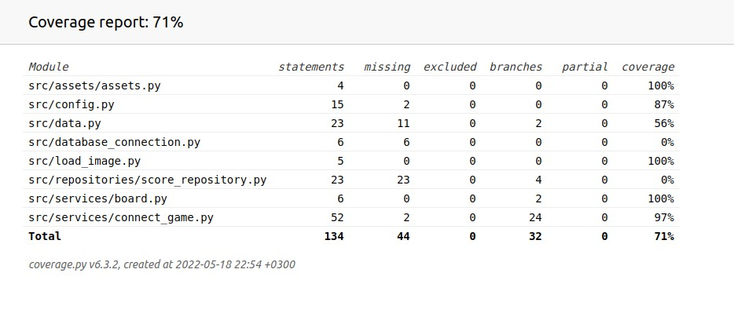

# Testausdokumentti

## Sovelluksen testaus yksikkötesteillä

Sovellusta on valitettavasti testattu vain yksikkötesteillä.

Yksikkötestit testaavat, että pelilaudan kaikki toiminnallisuudet toimivat kuten pitääkin eli pelimerkkejä ei esimerkiksi ole mahdollista laittaa laudan ulkopuolelle, täynnä oleviin riveihin ei voi laittaa enempää pelimerkkejä yms.
